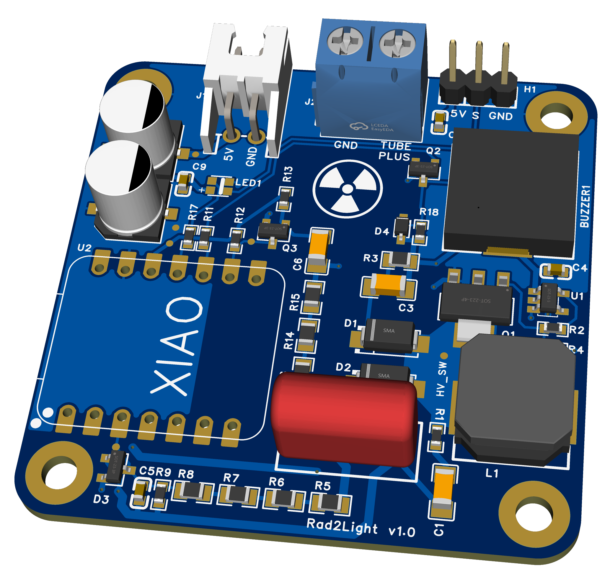
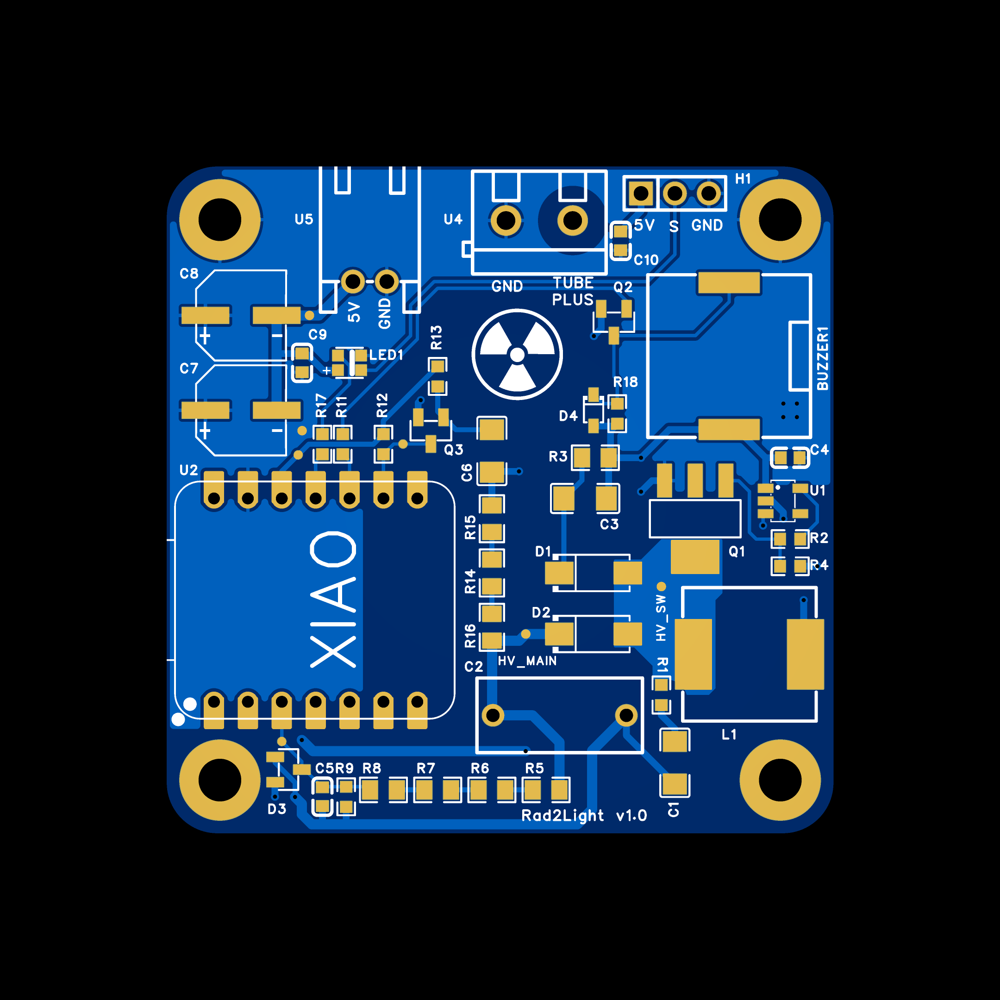
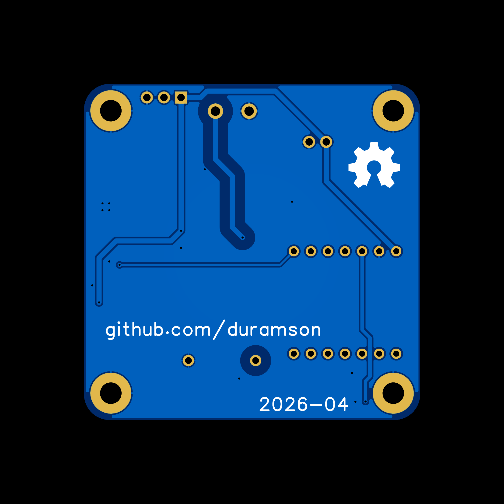
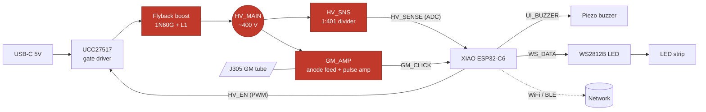

# Rad2Light: Smart Geiger Counter (ESP32-C6)

[](https://github.com/duramson/rad2light/actions/workflows/firmware-ci.yml)
[](LICENSE)

<p align="center">
  
</p>

An open-source Geiger counter board built around the Seeed Studio XIAO ESP32-C6,
with closed-loop high-voltage regulation, a WS2812B status LED that chains into an
addressable strip, and WiFi/BLE on the MCU. The hardware is a reworked take on the
well-known Cajoe Geiger counter, with a proper gate driver, drain protection, and
sane voltage derating across the high-voltage section.

> [!WARNING]
> **Work in progress.** This is an active hobby project, not a finished product.
> The current hardware revision has not been fabricated or validated on real boards
> yet, and the schematic and PCB layout still need a cleanup pass before they are
> trustworthy. The firmware in this repo is bring-up and test code, not the final
> application firmware. Treat everything here as a snapshot of the design as it
> stands, and do not build the high-voltage section unless you know how to work
> safely around ~400 V.

> [!CAUTION]
> This circuit generates roughly 400 V DC. That voltage can hurt you, and the HV
> capacitor stays charged after power is removed. Discharge it before handling the
> board.

## What is here

The design started from the [Cajoe Geiger counter](https://github.com/SensorsIot/Geiger-Counter-RadiationD-v1.1-CAJOE)
and was reworked block by block. The longer-term goal is "Schroedinger's Lamp": a
wall light whose LED behavior is driven by radioactive decay events.

The two design notes explain the reasoning, not just the result:

- [`docs/design-decisions.md`](docs/design-decisions.md): why each circuit choice
  was made (gate driver, drain protection, divider ratios, regulation strategy).
- [`docs/pcb-notes.md`](docs/pcb-notes.md): layout rules, trace widths, HV
  clearances, guard ring, antenna keepout.
- [`docs/firmware-notes.md`](docs/firmware-notes.md): full pin mapping, block
  descriptions, and the bring-up procedure.
- [`docs/bring-up.md`](docs/bring-up.md): the staged commissioning ladder and how
  the compile-time `BRINGUP_STAGE` gate blocks the HV path on a fresh board.




## System overview

Power and signal flow between the functional blocks. The red nodes carry the
~400 V high-voltage domain. The MCU closes the HV control loop (HV_EN out,
HV_SENSE back in) and reads decay pulses on GM_CLICK.



## Hardware overview

| Block | Function | Key parts |
|---|---|---|
| HV_GEN | Flyback boost 5 V to ~400 V | UCC27517 (U1), 1N60G (Q1), 1mH inductor (L1), US1M (D1/D2) |
| HV_SNS | Voltage divider plus ADC clamp | 4 x 3.3M + 33k (1:401), BAV99 (D3), 10nF filter |
| GM_AMP | Tube pulse to digital edge | 3 x 1.5M anode feed, 1nF/1kV AC coupling, MMBT3904 (Q3) |
| UI | Buzzer plus WS2812B | Murata piezo, MMBT3904 (Q2), WS2812B-2020 (LED1) |
| MCU | XIAO ESP32-C6 | WiFi/BLE, ADC, PWM, ISR, USB-C |
| Connectors | Tube, external power, strip | KF301 screw terminal, JST XH 2-pin, 3-pin header |

### Pin mapping

| GPIO | Net | Function |
|---|---|---|
| GPIO2 (A2/D2) | `HV_SENSE` | ADC, HV feedback |
| GPIO17 (D7) | `HV_EN` | PWM to UCC27517 to Q1 gate |
| GPIO19 (D8) | `GM_CLICK` | ISR, tube pulses (rising edge) |
| GPIO20 (D9) | `UI_BUZZER` | Buzzer driver Q2 |
| GPIO18 (D10) | `WS_DATA` | WS2812B data line |

The GM tube is a J305 (or compatible), operating around 400 V, connected through
the KF301 screw terminal (U4).

## Repository layout

```
.
├── docs/                  Design notes and board renders
│   ├── design-decisions.md
│   ├── pcb-notes.md
│   ├── firmware-notes.md
│   ├── bring-up.md
│   └── images/
├── hardware/              Schematic, BOM, netlist, component labels
│   ├── schematic.pdf
│   ├── bom.csv
│   ├── netlist.tel
│   ├── component-labels.html
│   ├── interactive-bom.html   Clickable board-to-BOM viewer (open locally)
│   └── fab/               Fabrication output (Gerbers, preliminary)
├── firmware/
│   ├── platformio.ini
│   ├── src/main.cpp       Bring-up and test firmware
│   └── reference/         Original Cajoe lamp code, kept for porting
└── .github/workflows/     CI: PlatformIO build + clang-format check
```

## Building the firmware

Requires [PlatformIO](https://platformio.org/) (CLI or VS Code extension).

```bash
cd firmware
pio run                 # compile
pio run -t upload       # flash
pio device monitor      # serial monitor (115200 baud)
```

### Serial commands (bring-up firmware)

```
HV ON / HV OFF    HV regulation on/off
STATUS            all values (V_HV, duty, CPM, CPS)
DUTY <0-50>       fixed duty without regulation (calibration)
CAL               continuous ADC readout
CLICK             buzzer test
LED <r> <g> <b>   onboard LED color test
STRIP <n>         set strip length
STOP              exit CAL/DUTY mode
HELP              list commands
```

### Firmware safety behavior

- HV does not start automatically at boot.
- Overvoltage above 460 V triggers an immediate shutdown.
- A software watchdog kills HV if the main loop stalls for more than 500 ms.
- Soft start ramps the duty cycle over 500 ms.
- A compile-time `BRINGUP_STAGE` gate blocks the HV path on a half-populated board.
  See [`docs/bring-up.md`](docs/bring-up.md).

## Continuous integration

Every push and pull request runs [`.github/workflows/firmware-ci.yml`](.github/workflows/firmware-ci.yml),
which builds the firmware with PlatformIO and checks formatting with clang-format
against [`.clang-format`](.clang-format). Run the same checks locally:

```bash
clang-format --dry-run --Werror firmware/src/main.cpp
cd firmware && pio run
```

## Ordering

- PCB: JLCPCB, bare boards, tented vias, blue soldermask.
- Components: LCSC, all part numbers are in [`hardware/bom.csv`](hardware/bom.csv).
  For assembly, [`hardware/interactive-bom.html`](hardware/interactive-bom.html) is a
  clickable board-to-BOM viewer. GitHub does not render it inline, so download the
  raw file and open it in a browser.
- Tube: J305 GM tube (sourced separately).
- MCU: Seeed Studio XIAO ESP32-C6.

## License

MIT. See [`LICENSE`](LICENSE).
